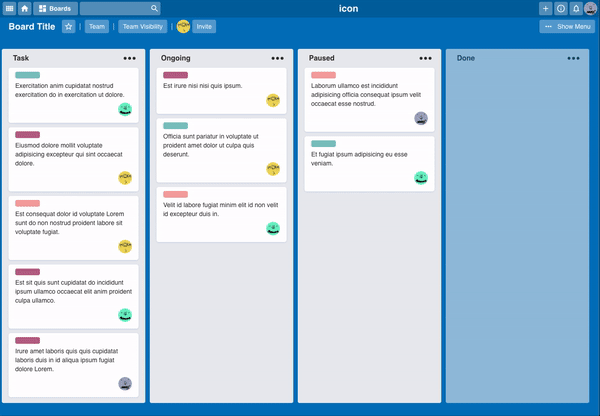

# Kanban-Board-like application

*kanban*-Board-like application using **Trello** as reference.

Created using react (Bootstraped using [**create-react-app**](https://create-react-app.dev/docs/getting-started/));

#### Lessons learned

Used this project to work on:
- React folder/structure organization (Components, services, global styles...).
- Styled Components and CSS in general. Tried to recreate the application as if it was handed over by the design team, just image reference (did not inspect Trello code to see how they done it).
- Drag and drop using React-dnd. But I will still try to do it with React-spring to see which one is better.
- General configuration of an application (ESLint, prettier, etc);

### Resources

#### Cards Drag and Drop
Used "react-dnd" lib;

#### Cards randomly generated using:
- [Avatars.io](http://avatars.adorable.io/);
- lorem-ipsum (Lib);

#### Styles:
Used libs: "react-icons" and "styled-components"

## How to run?
Download the project and run: `yarn start`

---

#### Problems to fix / Next steps

##### Problems
- Cards cannot be placed in 'empty areas' of the list
- Cards cannot be dragged to empty lists
- There seems to be a glitch in the end of the list. (if you shrink the screen vertically)
##### Possible solutions:
- Turn the LIST into a "dropabble" item.

##### Functionalities to add
- Side/slide menus
- Create an user to display the information.

---
\
\
\
That's all for now. 👨🏻‍💻  

